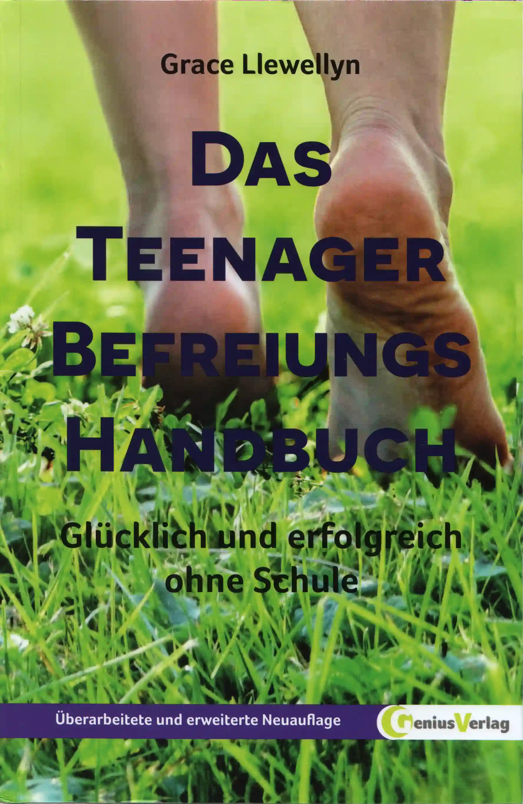

# Grace Llewellyn - Das Teenager Befreiungs Handbuch (2014)



https://www.amazon.de/dp/3934719570

<blockquote>

Das Teenager Befreiungs Handbuch: Glücklich und erfolgreich ohne Schule

Dagmar Neubronner (Herausgeber),
Luise Fuchs (Herausgeber),
Grace Llewellyn (Autor),
Dagmar Mallett (Übersetzer)

3.6 out of 5 stars, (7) ratings

'Dieses Buch ist gefährlich.
Es widerspricht allen üblichen Weisheiten über Schulabbrecher und die Wichtigkeit von Schulabschlüssen.
Es wirkt belebend und inspirierend.
Lassen Sie dieses Buch auf keinen Fall in die Hände eines aufgeweckten,
frustrierten Jugendlichen gelangen, den das Schulsystem anödet.
Die Autorin kann für das daraus möglicherweise entstehende Glück
und das Gefühl von Eigenverantwortung keinerlei Verantwortung übernehmen.'

'Dein Leben, deine Zeit und dein Gehirn sollten keiner Institution gehören, sondern dir.'

Dieses Handbuch ist für alle, die jemals zur Schule gegangen sind,
aber es ist ganz besonders ein Buch für Teenager und Leute,
die viel mit Teenagern zu tun haben.

Aus dem Inhalt:

- gute Gründe, über den Abschied von der Schule nachzudenken
- wie du deine natürliche Fähigkeit, dein eigener Lehrer zu sein, wiederentdeckst
- wie du die Unterstützung deiner Eltern gewinnst, deine Freunde behältst und mit den Behörden klarkommst
- wie du dir dein ureigenes spannendes Bildungsprogramm maßschneiderst
- wie du studierst, ohne vorher zum Gymnasium zu gehen
- wie du ehrenamtliche Jobs, Praktika, und andere Gelegenheiten zur praktischen Arbeit findest
- wie andere Teenager weltweit ohne Schule leben und lernen.

Moritz und Thomas Neubronner gehen nicht zur Schule und sind deswegen bundesweit bekannt geworden.
Ihre Eltern, die Inhaber des Genius Verlages,
waren zunächst sehr frustriert über den Schulstreik ihrer Kinder.

Inzwischen haben sie verstanden,
dass ihre Kinder ohne Schule mehr und lieber lernen und vor allem viel glücklicher sind –
wie Millionen Kinder weltweit.

Dieses Buch zeigt konkret, wie das geht – auch in Deutschland.

- Herausgeber: Genius Verlag
- Erscheinungstermin: 1. November 2014
- Auflage: 2., Bearbeitete und erweiterte Neuauflage
- Sprache: Deutsch
- Seitenzahl der Print-Ausgabe: 590 Seiten
- ISBN-10: 3934719570
- ISBN-13: 9783934719576
- Abmessungen: 14.9 x 4 x 23.1 cm
- Amazon Bestseller-Rang:
  - Nr. 956.402 in Bücher
  - Nr. 3.655 in Schulratgeber
  - Nr. 132.407 in Schule & Lernen

</blockquote>

## scans

### teenager.befreiungs.handbuch.von.grace.llewellyn.v2.2014.german.book.scan.600dpi.deskew.tiff

```
magnet:?xt=urn:btih:e1528946d613013443346225c8a6addaea7b3329&dn=teenager.befreiungs.handbuch.von.grace.llewellyn.v2.2014.german.book.scan.600dpi.deskew.tiff&xl=2362782455&tr=udp%3A%2F%2F45.9.60.30%3A6969%2Fannounce&tr=udp%3A%2F%2F185.216.179.62%3A25%2Fannounce&tr=udp%3A%2F%2F93.158.213.92%3A1337%2Fannounce&tr=udp%3A%2F%2F107.189.2.131%3A1337%2Fannounce&piece_size=4194304
```

## mirrors

- https://github.com/milahu/teenager-befreiungs-handbuch-von-grace-llewellyn-2014
- http://gg6zxtreajiijztyy5g6bt5o6l3qu32nrg7eulyemlhxwwl6enk6ghad.onion/milahu/teenager-befreiungs-handbuch-von-grace-llewellyn-2014
- http://git.dkforestseeaaq2dqz2uflmlsybvnq2irzn4ygyvu53oazyorednviid.onion/milahu/teenager-befreiungs-handbuch-von-grace-llewellyn-2014
- http://it7otdanqu7ktntxzm427cba6i53w6wlanlh23v5i3siqmos47pzhvyd.onion/milahu/teenager-befreiungs-handbuch-von-grace-llewellyn-2014


## template

this repo is based on
[github.com/milahu/hocr-files-template-repo](https://github.com/milahu/hocr-files-template-repo).
if you want to copy this repo,
then please copy the template repo,
which has the latest versions of all files.


## related

- [github.com/milahu/books](https://github.com/milahu/books) - books on the topic of selforganization
